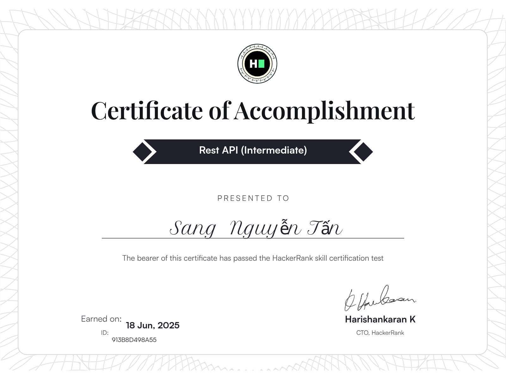

<h2 align="center">🛠 Technologies and Tools 🛠</h2>
 
<!-- https://simpleicons.org/ -->

&nbsp;

&nbsp;

&nbsp;

&nbsp;

&nbsp;

&nbsp;

&nbsp;

&nbsp;

&nbsp;

&nbsp;

&nbsp;

&nbsp;

&nbsp;

&nbsp;

&nbsp;

&nbsp;

&nbsp;

 
<h2 align="center">🔥 GitHub Stats 🔥</h2>
<!-- https://github.com/anuraghazra/github-readme-stats -->
 

  
  <!-- Stats Cards -->
  
  
  
  <!-- Language Pie Chart & Productive Time -->
  
  
  
  <!-- Contribution Graph (Full width) -->
  
  
  <!-- Activity Graph (Full width) -->
  
  
  <!-- Streak Stats (Full width) -->
  
  

 
<h2 align="center">👽 Where to find me 👽</h2>
 
<!-- https://icons8.com -->

 
 

  
  
  

 

 
 
<h2 align="center">📑 My Favorites Quote 📑</h2>
 

<h2 align="center"> 🏆 Certificates </h2>

  
HackerRank Certificates

  
  
  
  

  
Udemy Certificates

  
  

  
In University Certificates

  

