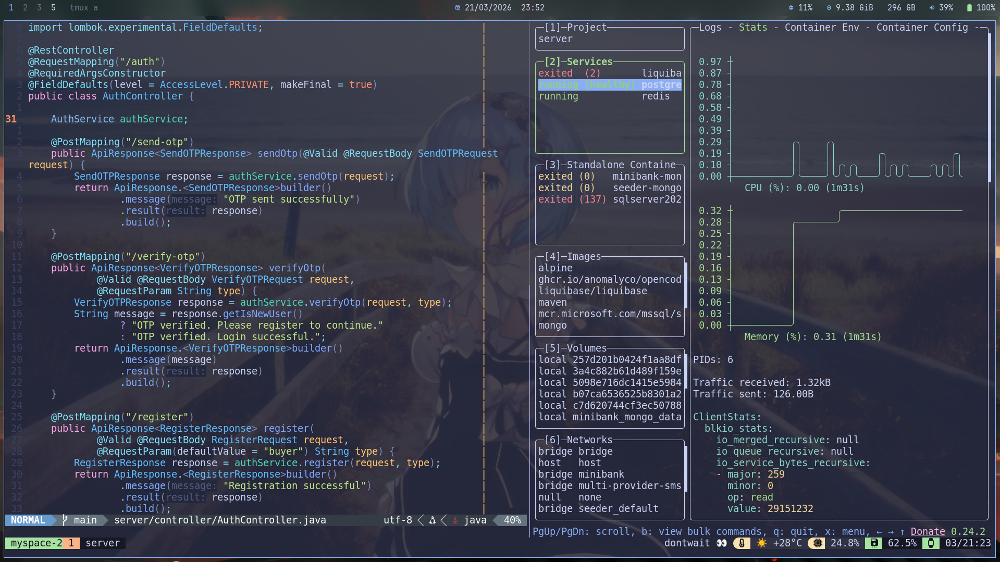
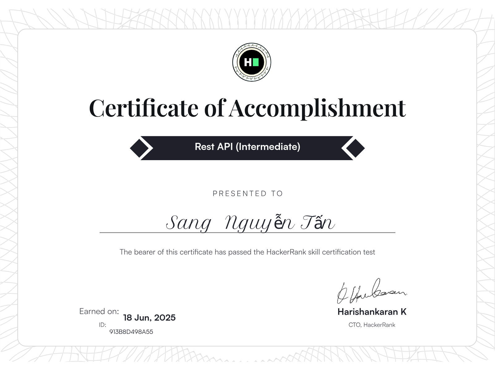
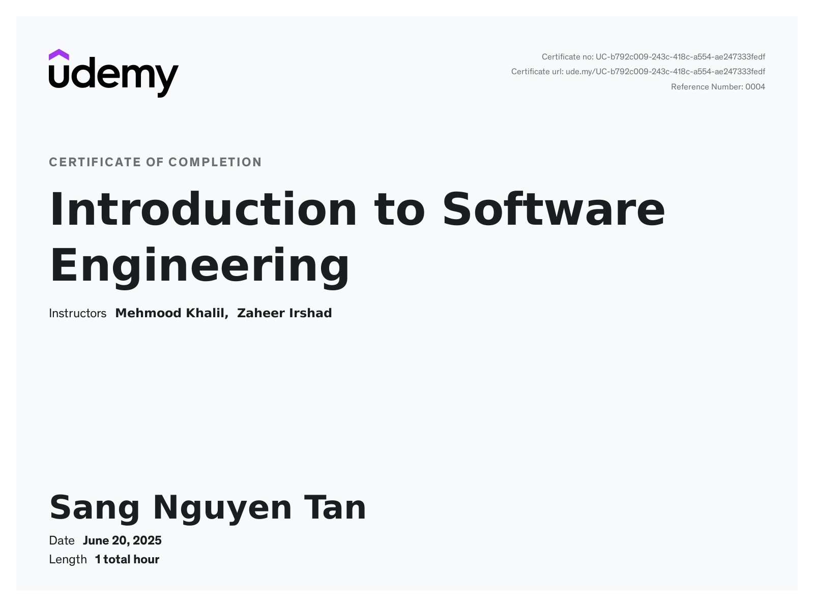
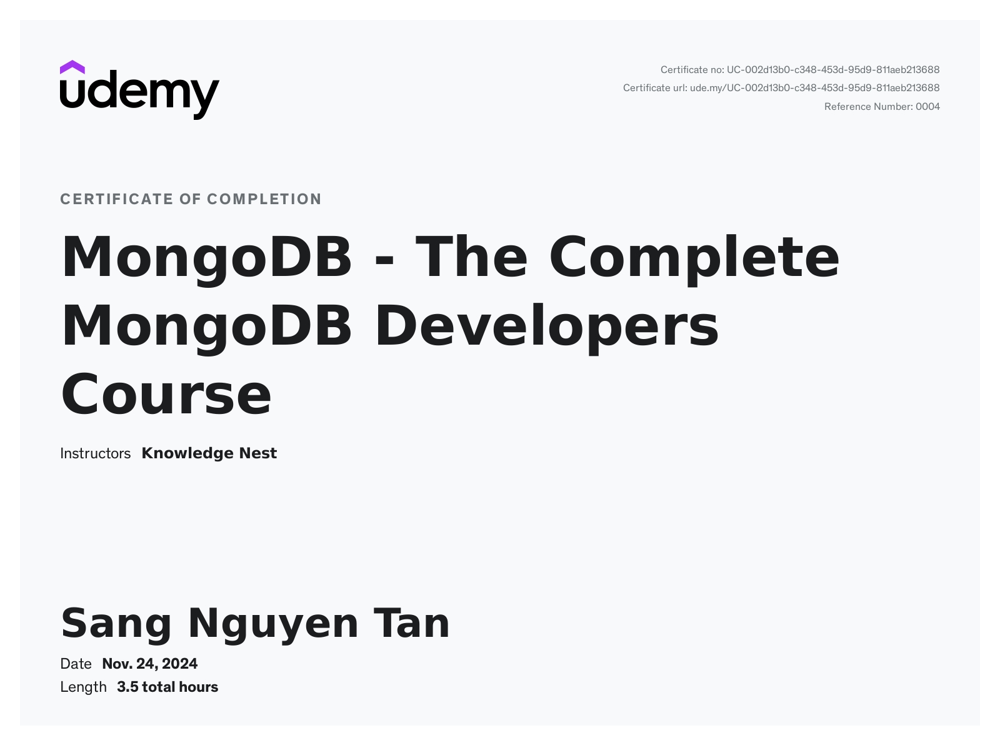

  <table>
    <tr>
      <td width="60%" align="left">
        <h2 align=center>Sang Nguyen Tan</h2>
        <ul>
          <li>Focused on <strong>optimizing, building, and organizing</strong> software architecture</li>
          <li>Working primarily with <strong>Java, C#</strong> and its frameworks, <strong>SQL</strong></li>
          <li>Striving for <strong>efficient and scalable</strong> solutions</li>
          <li>Dedicated to <strong>continuous learning</strong> and improvement</li>
          <li>Contributing effectively in <strong>team projects</strong></li>
          <li style="list-style: none;">
          <a href="./SangNguyenTan_CV_BE_Intern.pdf">
            View CV
          </a>
        </li>    
        </ul>
      </td>
      <td width="100%">
        
      </td>
    </tr>
  </table>

<h2 align="center">🛠 Technologies and Tools 🛠</h2>
 

| **Category** | **Tech Stack** |
|:---:|:---|
| **Languages** |    |
| **Backend** |         |
| **Database** |    |
| **Productivity System** |    |
| **Social Links** |     |

 
<h2 align="center">💻 My Setup 💻</h2>
 

 
<h2 align="center">🔥 GitHub Stats 🔥</h2>
<!-- https://github.com/anuraghazra/github-readme-stats -->
 

  
  <!-- Stats Cards -->
  
  
  
  <!-- Language Pie Chart & Productive Time -->
  
  
  
  <!-- Contribution Graph (Full width) -->
  
  
  <!-- Activity Graph (Full width) -->
  
  
  <!-- Streak Stats (Full width) -->
  
  

 
<h2 align="center">👽 Where to find me 👽</h2>
 
<!-- https://icons8.com -->

 
 

  
  
  

 

 
 
<h2 align="center">📑 My Favorites Quote 📑</h2>
 

<h2 align="center"> 🏆 Certificates </h2>

  
HackerRank Certificates

  
  
  
  

  
Udemy Certificates

  
  

  
In University Certificates

  

